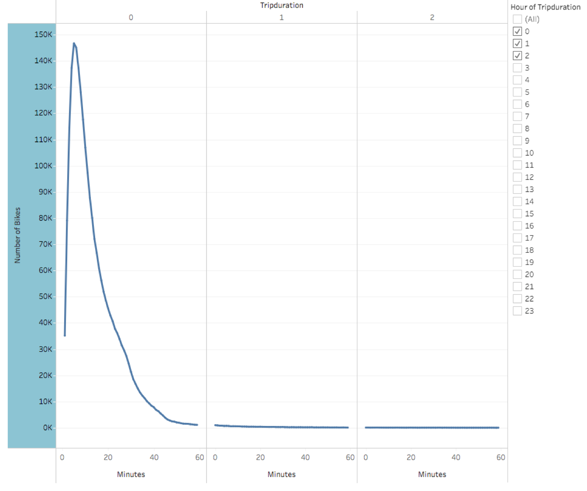
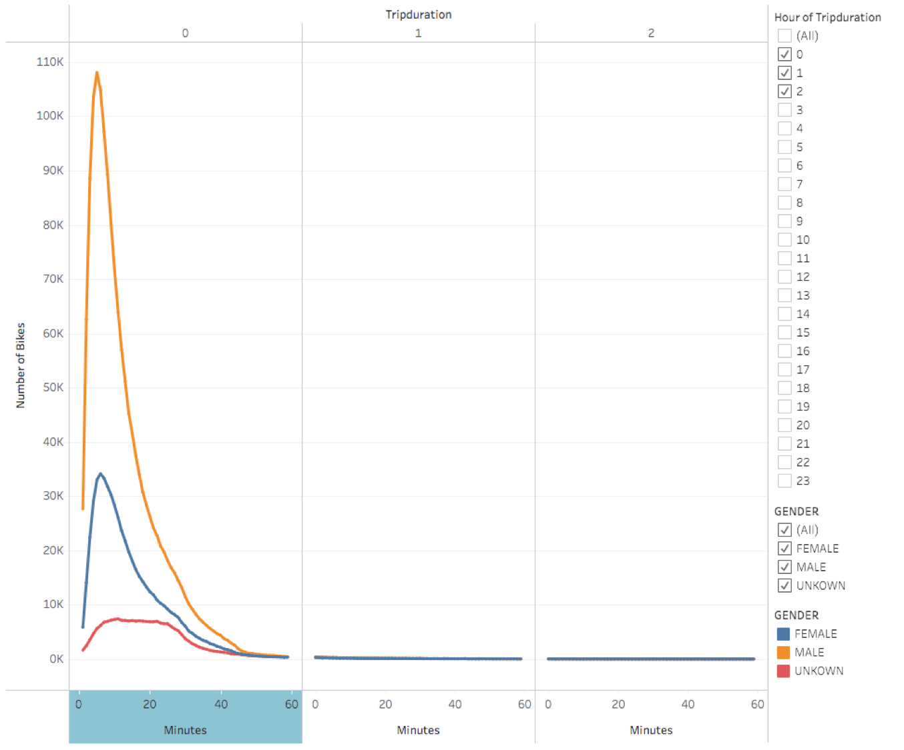
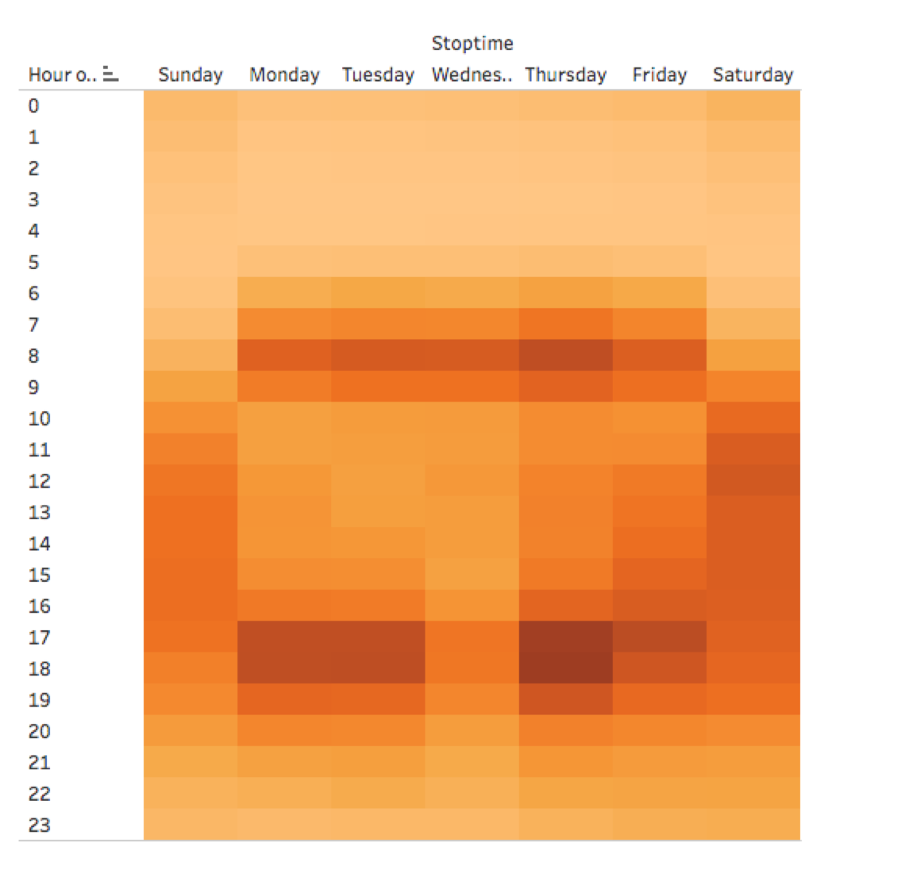
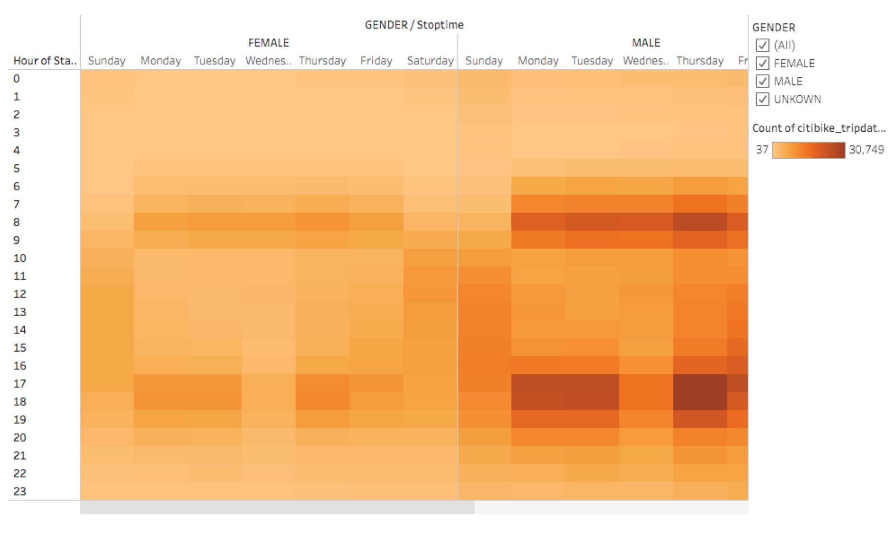
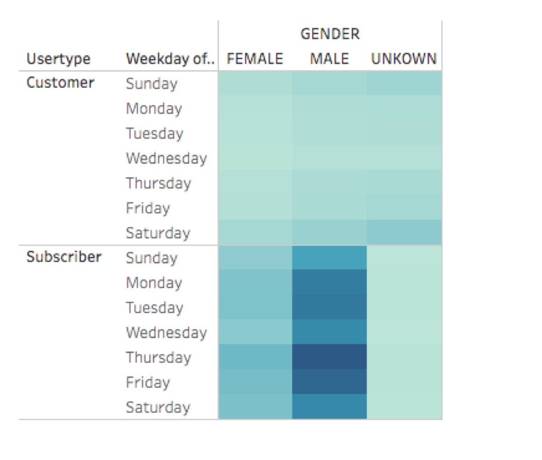

# bikesharing

## Overview 

The objective of the project is to analyze public Citi Bike data from NYC in order to put together a presentation for potential investors to build a similar program in Des Moines, Iowa. The analysis is intended to address the following quetions:

Who and what is the proporsion of bike users?

What part of the city are the bikes mostly used?

What are the peak hours and lowest hours for bike trips?

What is the trip duration per riders and genders?

Number of bike trips for type of user and gender for each day of the week?

Tableau was used to visualize bike-sharing data and addressed above questions. The link to the Tableau story is: [Here](https://public.tableau.com/authoring/Citybike_tripdata/UserTripsbyGenderbyWeekday/NYC%20Citibike%20Analysis#1)

---
## Results

Image below shows the demographic of bike users. From the total users, about 81% are subscribers representing a consistent source of income for the program. The gender breakdown shows that 65% are male users, 25% are female users and the rest unkown.

The map shows the location in the city where bikes are mostly used. It is noticed that the center of the city is where the concentration of bikes rides is located, given by the darker and bigger size of the bubbles, whereas the smaller and lighter color of the bubbles are located in the boundaries of the city   

The bar chart shows the peak hours and lowest hours for bike trips. Rush hours is where bikes have the highest usage while hours between 2:00am and 5:00am bikes have the lowest usage  

The trip duration by overall user is less than an hour, where the highest bike usage lasts between 5 and 15 minutes. The breakdown of users by gender shows similar trip duration

The heat map shows the number of trips by weekday per hour. It can be seen that the highest number of trips during weekdays occur in rush hours while on weekends occur mostly on saturdays and between 9:00am and 8:00pm

The trend of highest number of trips is driven by male users

The breakdown of number of trips by user type and gender by weekday, confirms the trend that users is driven by male and subscribers.

---
## Summary

The overall analysis demonstrated that the citibike program is very popular in the metropolitan part of the city, making it very convenient where parking spaces could be an issue as well as traffic. The program subscribers are the highest users of the program as well as male users compare to female    

---
