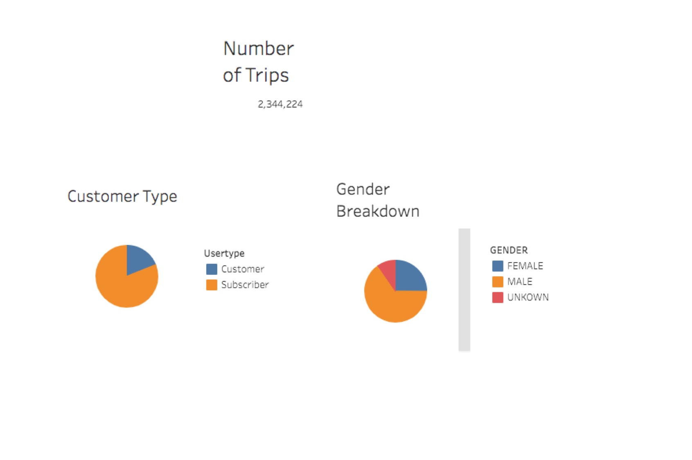
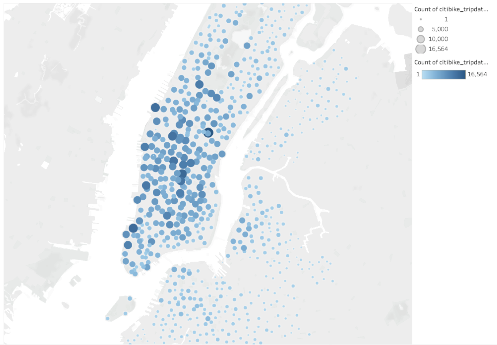
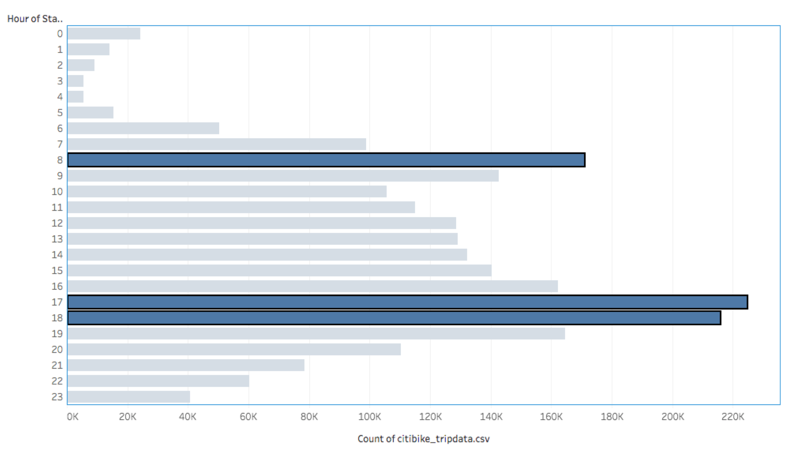

# bikesharing

## Overview 

The objective of the project is to analyze public Citi Bike data from NYC in order to put together a presentation for potential investors to build a similar program in Des Moines, Iowa. The analysis is intended to address the following quetions:

Who and what is the proporsion of bike users?

What part of the city are the bikes mostly used?

What are the peak hours and lowest hours for bike trips?

What is the trip duration per riders and genders?

Number of bike trips for type of user and gender for each day of the week?

Tableau was used to visualize bike-sharing data and addressed above questions. The link to the Tableau story is: [Here](https://public.tableau.com/authoring/Citybike_tripdata/UserTripsbyGenderbyWeekday/NYC%20Citibike%20Analysis#1)

---
## Results

Image below shows the demographic of bike users. From the total users, about 81% are subscribers representing a consistent source of income for the program. The gender breakdown shows that 65% are male users, 25% are female users and the rest unkown.

The map shows the location in the city where bikes are mostly used. It is noticed that the center of the city is where the concentration of bikes rides is located, given by the darker and bigger size of the bubbles, whereas the smaller and lighter color of the bubbles are located in the boundaries of the city   

The bar chart shows the peak hours and lowest hours for bike trips. Rush hours is where bikes have the highest usage while hours between  

---
## Summary

One drawback of this webpage is that the user would need to refer to the data.js file in order to know all the criterias that can be input in this webpage. In order to fix this, an alternative would be to incorporate the data file into the webpage on a form of a list dropdown menu or a link to the data file so the user can aquickly visualize the criterias that can be used  

---
